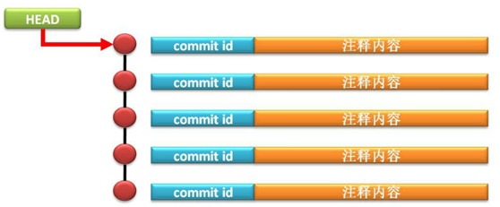

## git常用命令

1. **查看仓库状态**:`git status`

   在“git status”状态查询操作上可以发现有如下的几个提示信息：

   * 现在的开发属于主分支：On branch master

   *  初始化仓库的提交：Initial commit

   * 未标记的文件：Untracked files

   * 给出了一些操作的命令：(use "git add <file>..." to include in what will be committed)

   * 未跟踪的文件列表：readme.txt
<!--more-->

2. **新增文件到暂存区**:`git add "新文件名"`

   PS : 新增多个文件  git add 文件夹

   PS：新增所有文件 git add  --all

3. **提交文件到本地仓库**:`git commit -a -m "注释"`  

   可以提交删除、修改和已add过的新增文件，`-a`是add的意思，相当于新增和提交合成一步（新增文件如果不先add，使用此命令无效）

4. **撤销修改**

   * 情况一：文件未添加到暂存区

      通过git checkout -- <file>恢复到原始状态

   * 情况二：文件已经添加到暂存区，但是未提交到分支

   ​     通过git reset HEAD <file> 命令将文件从暂存区退出，此时就变成了情况一

5. **版本回退**？

   * 当用户每一次将自己的代码提交到版本库之后都会自动生成一个commit记录进行操作保存，每一条记录都会自动生成一个commit id进行唯一标识，而这个commit id就是进行代码回退的主要操作方式

   * 默认状态下的“HEAD”保存的是最后一次的提交点

     

     

   * ==具体命令后续更新、、、、==

6. **分支操作**

   * 创建分支

     |        命令         |          说明           |
     | :-----------------: | :---------------------: |
     | git checkout –b brh | 创建分支并切换到分支brh |
     |   git branch brh    |  只创建分支brh，不切换  |

   * 切换分支

     |       命令       |     说明      |
     | :--------------: | :-----------: |
     | git checkout brh | 切换到分支brh |

   * 分支改名

     |          命令          |        说明         |
     | :--------------------: | :-----------------: |
     | git branch –m brh test | 将分支brh改名为test |

   * 推送本地分支到远程服务器

     |        命令         |                             说明                             |
     | :-----------------: | :----------------------------------------------------------: |
     | git push origin brh | 将本地分支brh推送到远程服务器，此时远程服务器多了一个brh分支 |

   * 从远程服务器获取分支

     |           命令           |                        说明                        |
     | :----------------------: | :------------------------------------------------: |
     | git fetch origin dev:dev |      git fetch origin 远程分支名x:本地分支名x      |
     |   git merge origin/dev   | 如果本地已经创建了分支，则使用此命令与远程分支同步 |

   * 更新分支内容？

     |               命令                | 说明                                                    |
     | :-------------------------------: | ------------------------------------------------------- |
     | More Actions  git fetch orgin brh | 此操作只是获取最新的分支数据，但是不会发生merge合并操作 |
     |        git pull orgin brh         | 此操作获取最新的分支数据，且同时发生merge合并操作       |

   * 查看分支

     |     命令      | 说明                                       |
     | :-----------: | ------------------------------------------ |
     | git branch -a | 查看所有分支：包含本地分支和关联的远程分支 |
     | git branch -r | 查看本地已关联的远程分支                   |
     | git branch –l | 查看本地分支                               |

   * 删除本地分支？

     |       命令        | 说明                       |
     | :---------------: | -------------------------- |
     | git branch –D brh | 删除子分支(-d表示强制删除) |
     | git branch –d brh | 删除子分支(-d表示删除)     |

   * 删除远程服务器分支

     |                   命令                   | 说明                                                         |
     | :--------------------------------------: | ------------------------------------------------------------ |
     | git branch brh  git push origin **:**brh | 推送一个空的分支到远程服务器，服务器会认为此推送的目的就是为了删除分支 |
     |       git push origin --delete brh       | 通过命令直接删除远程分支brh                                  |

   * 分支合并

   ​        first: 切换到master分支

   ​        `git checkout masetr `

   ​        second: 合并brh分支(将brh分支的内容合并到master分支)

   ​        `git merge brh ` 

   
